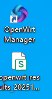
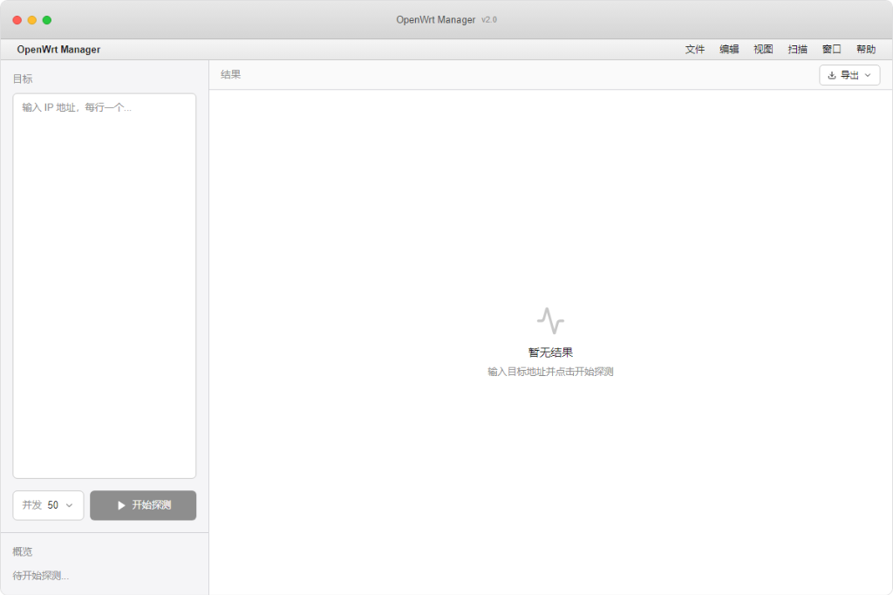
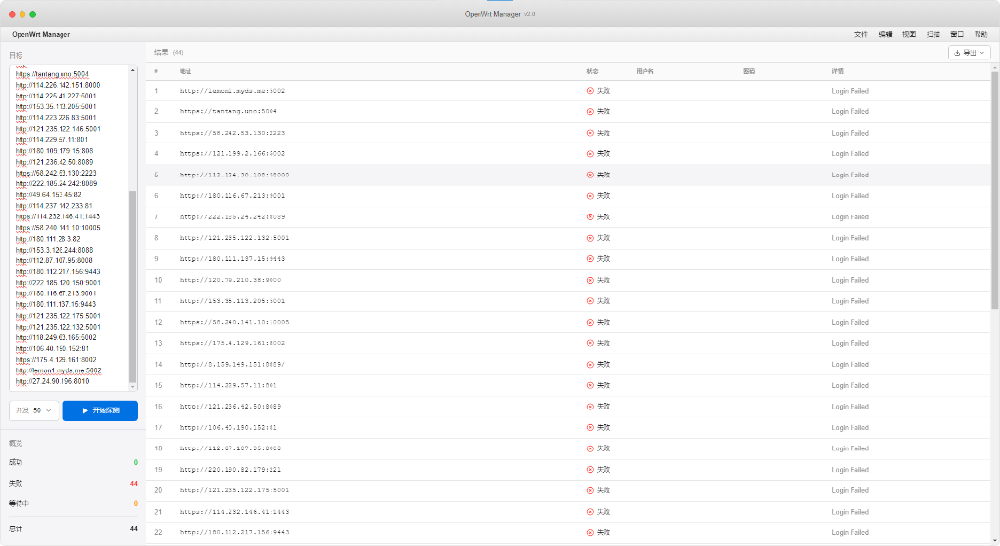

# OpenWrt Manager

<div align="center">


**一款现代化的 OpenWrt 路由器桌面管理工具**

[](LICENSE.txt)
[](#)
[](https://github.com/jeneekuqtfbruckk-cyber/openwrt-manager/releases)

</div>

---

## 📸 应用截图

<div align="center">

### 桌面图标


### 应用界面


### 扫描结果


</div>

---

## ✨ 功能特性

- 🔍 **智能扫描**：自动发现局域网内的 OpenWrt 路由器
- 🔐 **安全登录**：支持密码认证和会话管理
- 📊 **实时监控**：查看路由器状态和系统信息
- 🎨 **现代UI**：基于 Next.js 的精美用户界面
- ⚡ **高性能**：Electron + Python 混合架构
- 🔄 **批量操作**：支持同时管理多个路由器
- 📦 **一键安装**：专业的 NSIS 安装向导

---

## 📥 下载安装

### 系统要求

- **操作系统**：Windows 10/11 (64位)
- **内存**：至少 4GB RAM
- **磁盘空间**：200MB 可用空间
- **网络**：需要与 OpenWrt 路由器在同一局域网

### 安装步骤

1. 从 [Releases](https://github.com/jeneekuqtfbruckk-cyber/openwrt-manager/releases) 下载最新版本
2. 运行 `OpenWrt-Manager-Setup-0.1.0.exe`
3. 如遇 Windows 安全提示，点击"更多信息" → "仍要运行"
4. 按照安装向导完成安装
5. 启动应用开始使用

### ⚠️ 安全提示

本软件为开源项目，安全无毒。Windows/360 安全警告是因为未购买代码签名证书导致的正常现象。

**如何信任本软件**：
- **Windows SmartScreen**：点击"更多信息" → "仍要运行"
- **360 安全卫士**：点击"更多" → "仍要运行" → 勾选"不再提醒"

---

## 🚀 快速开始

### 首次使用

1. **启动应用**  
   双击桌面快捷方式或从开始菜单启动

2. **输入 IP 地址**  
   在左侧输入框输入路由器 IP（如 `192.168.1.1`）

3. **点击扫描**  
   应用会自动扫描并显示所有可用的 OpenWrt 路由器

4. **登录管理**  
   输入路由器的管理员账号和密码即可开始管理

### 常见问题

**Q：第一次扫描为什么全部失败？**  
A：后端服务首次启动需要 3-5 秒初始化时间。失败后请稍等片刻重试，第二次即可正常使用。

**Q：如何卸载？**  
A：控制面板 → 程序和功能 → OpenWrt Manager → 卸载

---

## 🛠️ 技术架构

### 核心技术栈

- **前端框架**：Next.js 16 + React 19
- **UI 库**：Tailwind CSS + Radix UI
- **桌面框架**：Electron 28
- **后端框架**：Python FastAPI
- **打包工具**：electron-builder + PyInstaller

### 项目结构

```
openwrt-manager/
├── open-wrt-manager-ui (2)/   # Next.js 前端 + Electron
│   ├── app/                   # Next.js 页面
│   ├── components/            # React 组件
│   ├── main.js                # Electron 主进程
│   └── package.json
├── backend/                   # Python 后端
│   ├── main.py               # FastAPI 服务器
│   ├── scanner.py            # 路由器扫描逻辑
│   └── backend.spec          # PyInstaller 配置
├── screenshots/              # 项目截图
└── README.md
```

---

## 💻 开发指南

### 环境准备

**Node.js**：
```bash
node -v  # 需要 v20 或更高版本
```

**Python**：
```bash
python --version  # 需要 Python 3.11+
```

### 本地开发

```bash
# 克隆仓库
git clone https://github.com/jeneekuqtfbruckk-cyber/openwrt-manager.git
cd openwrt-manager

# 安装前端依赖
cd "open-wrt-manager-ui (2)"
npm install

# 安装后端依赖
cd ../backend
pip install -r requirements.txt

# 启动开发服务器
cd "../open-wrt-manager-ui (2)"
npm run dev               # Next.js 开发服务器
npm run electron-dev      # Electron + Next.js
```

### 构建应用

```bash
# 构建后端
npm run build:backend

# 构建前端
npm run build:ui

# 打包桌面应用
npm run package
```

### 发布新版本

```bash
# 使用自动化发布脚本
npm run release
# 输入版本号（如 v2.0.2）
# 脚本会自动完成所有 Git 操作并触发 GitHub Actions
```

---

## 🤝 贡献指南

欢迎提交 Pull Request 或创建 Issue！

### 贡献流程

1. Fork 本仓库
2. 创建特性分支 (`git checkout -b feature/AmazingFeature`)
3. 提交更改 (`git commit -m 'Add some AmazingFeature'`)
4. 推送到分支 (`git push origin feature/AmazingFeature`)
5. 创建 Pull Request

### 代码规范

- 前端：遵循 ESLint 规则
- 后端：遵循 PEP 8 规范
- 提交信息：使用语义化提交格式

---

## 📄 开源许可

本项目采用 [MIT License](LICENSE.txt) 开源协议。

---

## 📞 支持与反馈

- **GitHub Issues**：[提交问题](https://github.com/jeneekuqtfbruckk-cyber/openwrt-manager/issues)
- **Releases**：[下载最新版本](https://github.com/jeneekuqtfbruckk-cyber/openwrt-manager/releases)

---

## 🙏 致谢

感谢以下开源项目：

- [Next.js](https://nextjs.org/) - React 前端框架
- [Electron](https://www.electronjs.org/) - 跨平台桌面应用框架
- [FastAPI](https://fastapi.tiangolo.com/) - 现代 Python Web 框架
- [Tailwind CSS](https://tailwindcss.com/) - 实用优先的 CSS 框架

---

<div align="center">

**⭐ 如果觉得有用，请给个 Star ⭐**

Made with ❤️ by OpenWrt Manager Team

</div>
